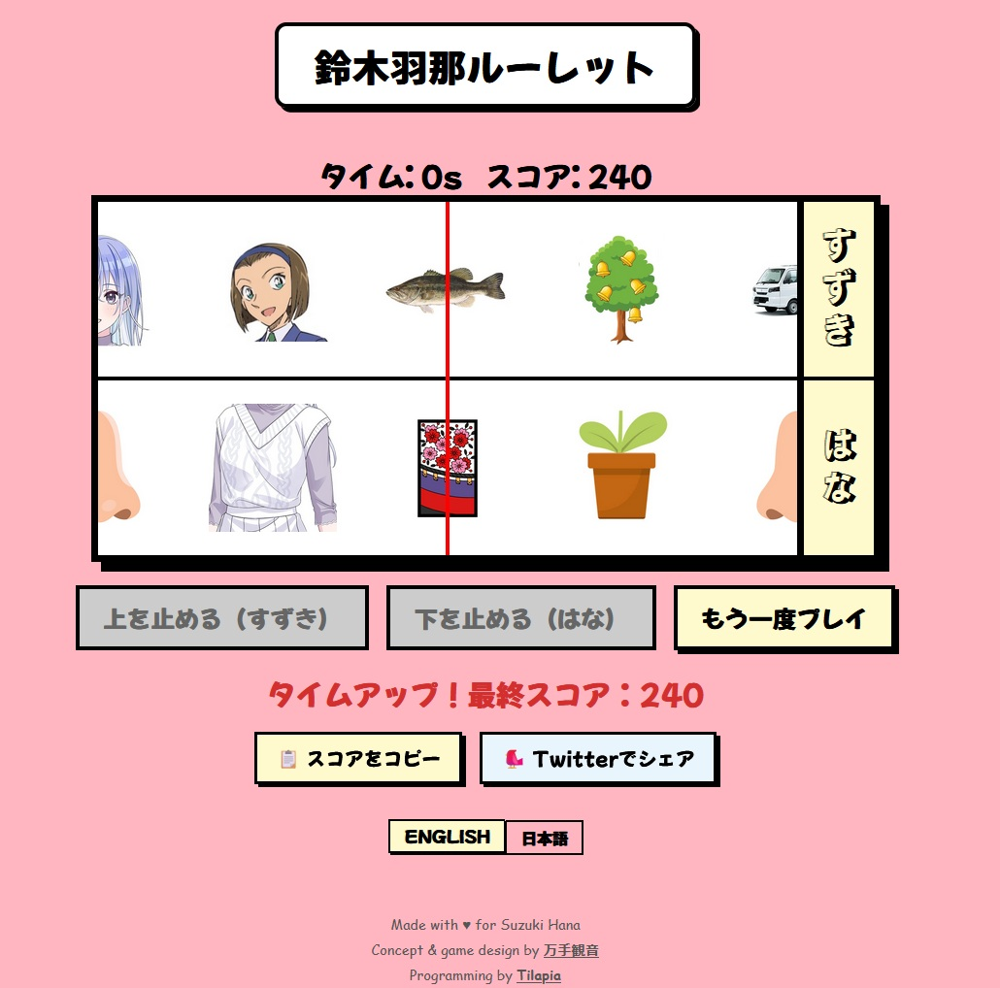

# 鈴木羽那ルーレット

A browser-based slot machine game built around puns on the name **鈴木羽那 (Suzuki Hana)**. Spin two reels and stop them to match images drawn from both readings of her name — 鈴木 (suzuki fish, Suzuki truck, bell tree…) and 羽那 (hana → nose, flower pot, hanafuda…). Score points based on which combinations land, and try to beat the clock.

Inspired (and effectively designed) from this tweet by 万手観音: https://x.com/pokka0801/status/2054481929500774521

## How to play

1. Press **SPIN** to start the timer and set the reels spinning.
2. Press **Stop Suzuki (Top)** and **Stop Hana (Bottom)** to lock each reel.
3. Score is awarded based on the combination — aim for a perfect 鈴木羽那 match.
4. The reels speed up as your score grows. You have 20 seconds per game.

The game supports **English and Japanese** and infers the default language from your browser locale.

## Credits

Made with ♥ for Suzuki Hana

Concept & game design by [万手観音](https://x.com/pokka0801)

Programming by [Tilapia](https://x.com/tilapiarena)

**Artwork sourced from:**
- [iM@S Wiki](https://project-imas.wiki/Hana_Suzuki)
- [Detective Conan World](https://www.detectiveconanworld.com/wiki/Sonoko_Suzuki)
- [Fish (鈴木 → 鱸)](https://zh.wikipedia.org/zh-tw/%E5%A4%A7%E5%8F%A3%E9%BB%91%E9%B1%B8)
- [スズキ](https://www.suzuki.co.jp/car/carry_customized/)
- [Bell tree (鈴木)](https://www.freevector.com/free-cartoon-tree-vector-19274)
- [Nose (鼻 → 羽那)](https://www.vecteezy.com/vector-art/9361806-human-nose-flat-clip-art-illustration-isolated-icon)
- [Flower pot](https://www.istockphoto.com/vector/home-flower-in-pot-vector-design-illustration-isolated-on-white-background-gm1154066666-313662878)
- [Hanafuda (花札 → 羽那)](https://en.wikipedia.org/wiki/Hanafuda)
